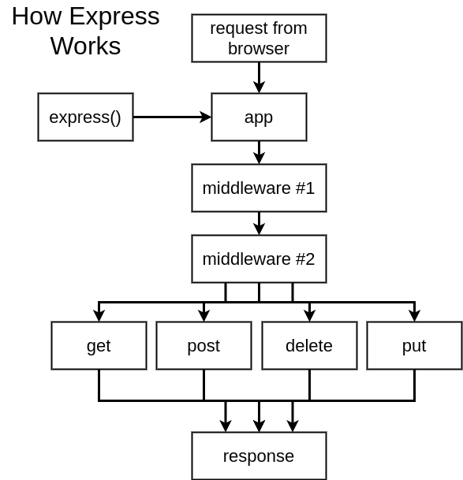

# Notas

En este bloc de notas voy a ir escribiendo todo lo que considero indispensable o importante para el desarrollo de una App con este stack de tecnologias.
El stack involucra: React, Node, Express y PassportJS
React como libreria principal para el desarrollo front end de la App y la logica de negocio.
Node como runtime de la app.
Express como Rout Handler. Este recibe las HTTP reqs a traves de Node, y decide en base al contenido de la misma, que ruta de funciones le vamos a devolver como response.

## Inicializacion del proyecto:

1. Creamos la carpeta raiz contenedora del server. (mkdir server)
2. Entramos en esta carpeta y hacemos un 'npm init' y le damos todo que si.
3. npm install --save express
4. Creamos el archivo index.js. Dentro de index.js vamos a tener 2 lineas de codigo iniciales que sirven para llamar al modulo express, para que node haga uso del mismo. Estas lineas son las siguientes.

```javascript
const express = require("express");
const app = express();
```

En la primer linea importamos el modulo (ver que usamos CommonJS y no usamos el metodo import), y en la segunda linea instanciamos una app express. En general vamos a estar usando una sola instancia de express.

## Deployment en Heroku

Para testear la app localmente, podemos levantar el localserver directamente instanciando app = express(), utilizando el metodo get de app y escuchando en el puerto 5000.

```javascript
var app = express();

app.get("/", function(req, res) {
  res.send("Hello World!");
});

app.listen(5000, function() {
  console.log("Example app listening on port 5000!");
});
var express = require("express");
```

En la consola tecleamos `node index.js` y automaticamente tenemos un servidor local escuchando a todas las peticiones que se hagan a traves del puerto designado.

### Deployment Checklist

- Dynamic Port Binding: Tenemos que configurar nuestra app para que escuche el puerto que nos asigne Heroku. Para esto, en nuestro index.js, antes de la linea app.listen(), escribimos:

```javascript
const PORT = process.env.PORT;
```

- Specify Node Enviroment: Vamos a decir a Heroku que use una version especifica de Node. Esto lo hacemos en package.json
- Specify start script: tenemos que decir a Heroku que comando correr para arrancar nuestro server. Esto tambien se lo comunicamos a Heroku en el package.json, y obviamente le vamos a decir que use nuestro index.js con el comando node para arrancar el puto server. "start": "node index.js"
- Create .gitignore file: tenemos que crear el gitignore para que no commitiemos ninguna dependencia que hayamos instalado. Asique dentro del .gitignore vamos a agregar node_modules

### FIRST Deploy:

- Hacernos cuenta en Heroku
- Inicializar repo local en la carpeta del proyecto con git init
- instalar CLI de Heroku
- Dentro de la carpeta de desarrollo, ejecutamos el comando 'heroku login'
- Despues de logearnos, le tiramos un 'heroku create' para crear la app heroku
- Vamos a ver que nos tira 2 links. El primero es el que vamos a usar si queremos usar nuestra app desde el browser. El segundo es nuestro 'Deployment Target'. Es el repositorio a donde vamos a pushear nuestro local repo.
- Entonces hacemos un git remote add heroku 'ruta de repo heroku que nos tiro el comando anterior'

### SUBSEQUENT Deploys:

- Guardamos los cambios
- git add . --> git commit
- Deployamos la app con Git--> git push heroku master
- Y una vez que pushea completo, podemos actualizar la pagina y nuestra app se vera con los nuevos cambios


## Googe Auth flow


## Nodemon:

Nodemon es un paquete de npm que nos facilita el trabajo de reiniciar el servidor local de node cada vez que hacemos un cambio en la aplicacion.
`npm install nodemon`.
_package.json "script" object_:
Una vez que instalamos nodemo, podemos agregar un shortcut para ejecutarlo como un script de npm, agregando el atributo "dev": "nodemon index.js" al objeto "script" del package.json. Despues ya podemos ejecutar en la consola `npm run dev`, y el servidor se va a reiniciar solo cada vez que introduzcamos un cambio en la app.

## Google OAuth:

- Ver OAuth flow-chart para entender el flujo de control que se lleva a cabo entre el cliente, el servidor, y google.
- PassportJS library--> Passport y Passport Strategy
- Dependiendo con que servicio (Google, Facebook, github, etc) vamos a hacer la autenticacion, para manejarla tenemos que usar el Passport Strategy correspondiente a ese metodo. Entonces de esta manera primero instalamos la libreria base que es Passport, y despues instalamos el passport strategy correspondiente al servicio que usemos.
- Instalamos Passport y el Passport Strategy de google-oauth dentro de nuestra carpeta de desarrollo, `npm install --save passport passport-google-oauth20`
- Nos loggeamos en console.developers.google.com' y creamos nuestro proyecto. Despues buscamos la api de google+ y configuramos las credenciales para obtener un ID de cliente.
- clientID: Public token, la podemos compartir, lo unico que hace es identificar nuestra aplicacion a los servidores de google.
- clientSecret: no la tenemos que compartir con nadie. Sino ellos tendrian privilegios en nuestra cuenta.
- Entonces tenemos que encontrar una manera segura de acceder a la clientSecret en nuestro codigo, sin vulnerar nuestra seguridad en el caso de que queramos por ejemplo subir el codgio a github. Es decir, tenemos que evitar hardcodearla. Para eso creamos la carpeta config y el archivo keys.js. En donde vamos a almacenar el googleClientID y el googleClientSecret.
-

## Organizacion y estructura de archivos del proyecto:

Para organizar un poco el codigo, agregamos los directorios routes (las rutas que usa express), y services. Ya teniamos el directorio config para las credenciales de la API de google.
En la carpeta de services, creamos un archivo que contiene la logica que ejecuta PassportJS para acceder a las credenciales, Y en la carpeta routes, creamos un archivo que contiene la logica de express para pedir la autorizacion a google para acceder a los datos requeridos del cliente, y la ruta para el callback que se ejecuta una vez concedida la autorizacion.

## MongoDB

MongoDB lo vamos a estar hosteando remotamente con un servicio que se llama MongoDB Atlas, y maneja la configuracion de la database en algun servicio de cloud que seleccionemos. En nuestro caso AWS, pero hay otras opciones como Azure etc. Esta decision es debido a que es mucho mas facil delegar toda esta configuracion de la DB a Atlas que hacerlo por nuestra cuenta de manera Local.
Con MongoDB podemos tener colecciones de objetos que tienen propiedades totalmente diferente, e incluso distinta cantidad de propiedades. Es una de las principales diferencias con una base de datos relacional clasica como MySQL.

### mongoose.js

Mongoose es la libreria que se usa para contectarse con MongoDB.
_Model Class_: La model class es una manera de instanciar una coleccion de objetos en MongoDB a traves de mongoose.
En nuestra aplicacion, necesitamos crear una coleccion de usuarios para crear una instancia de cada usuario que se Registro en la app la primera vez, de modo que si en algun momento vuelve a loggearse, podamos consulta en la DB si ese usuario ya esta registrado.
En mongoose tenemos que usar una propiedad llamada Schema, que de alguna manera nos exije que le aclaremos que esquema de propiedades van a tener los objetos que vamos a almacenar en la base de datos. Esto nos saca la libertad que nombramos anteriormente en las caracteristicas principales de MongoDB.
La model class, o en terminos de MongoDB, la nueva Collection, la instanciamos con:

```javascript
mongoose.model("user", userSchema);
```

El metodo de creacion de model class solo lo ejecuta si no exista esa model class previamente creada.

### Agregando un nuevo registro a la DB:

Recordemos que dentro de **./services/passport.js** tenemos la instancia de GoogleStrategy, la cual tiene como segundo argumento, un callback que nos devuelve 4 objetos: entre ellos, tenemos el objeto _profile_. De ahi es que vamos a extraer el atributo 'id' para guardarlo en la DB como prueba de que el cliente se registro.
La Model Class de la coleccion _users_ la tenemos definida en **User.js**.
Ahi vemos como usamos la clase Schema del objeto mongoose para crear un nuevo esquema. Hay un temita con esto, y es que por una cuestion de como trabaja mongoose, no podemos simplemente exportar esta clase e importarla en donde queramos. Podmos considerar que una vez que se creó ese new Schema, despues solo necesitamos hacer un require de mongoose en el archivo que la queramos usar, e instanciar una nueva clase en doonde a mongoose.model le pasamos solo como parametro la coleccion que vamos a modificar en esa instancia. Ejemplo:

```javascript
const mongoose = require("mongoose");

const User = mongoose.model("users"); //Aca User hereda el Schema que ya le dimos previamente
```

**Guardando un registro**:

```javascript
new User({ googleId: profile.id }).save(); //Donde googleId es la propiedad que queremos guardar para este nuevo registro de la coleccion users
```

**Otro detalle a tener en cuenta**, es que el orden de los `require()` importa. De hecho, en el _index.js_, tenemos que importar primero _models/User_ y despues _services/passport_, porque sino el codigo que hay en passport va a querer empezar a usar la coleccion `mongoose.model('users')` sin que todavia se haya instanciado en _User.js_.

### Mongoose Queries:

Podemos usar `User.findOne({ object })` por ejemplo para hacer una consulta a la base de datos buscando si dicho objeto existe.
A tener en cuenta, **Las Queries son ASINCRONAS**. Por lo tanto el metodo findOne, nos devuelve una promesa. Osea que cualquier cosa que queramos hacer en consecuencia a la respuesta de esa Query, lo tenemos que escribir dentro de un `.then()`.

### Generacion de Cookies:

Cuando tengamos un nuevo login de un cliente, el callback de passport se va a fijar si el cliente ya esta registrado en la base de datos chequeando si su googleId existe en la coleccion users. En caso de que exista, ya nos olvidamos de googleId. Ahora vamos a usar el id que genero MongoDB cuando se instancio ese usuario por primera vez, y lo vamos a pasar dentro de una cookie, para que el browser de ese usuario pueda volver a tener acceso a la base de datos sin tener que volver a autenticarse mediante su googleId. Esta operacion la vamos a llevar a cabo mediante Passport, ustilizando serializeUser y deserializeUser:

```javascript
passport.serializeUser((user, done) => {
  done(null, user.id);
});
```

Ese id es el \_id: "iu1y3r87y4aksd" que genero MongoDB, y es la pieza de informacion que le vamos a pasar a la cookie, y la cual vamos a tomar posteriormente con deserializeUser.

```javascript
passport.deserializeUser((id, done) => {
  User.findById(id).then(user => {
    done(null, user);
  });
});
```

Passport es un conjunto de helpers que hacen mas facil la tarea de autenticacion y seguimiento de usuario, el uso de cookies para este ultimo fin, es uno de sus metodos. Para esto, hay que asegurarse de que passport sepa que vamos a usar cookies para trackear los usuarios.

### Cookie Session

Instalamos el paquete con `npm install cookie-session` y lo importamos en nuestro _index.js_.
Ademas tenemos que importar passport en nuestro index.js para poder usar las cookies.

```javascript
app.use(
  cookieSession({
    maxAge: 30 * 24 * 60 * 60 * 1000, //30 dias expresados en ms.
    keys: [keys.cookieKey]
  })
);
```

En este bloque, utilizamos la libreria cookie-session para definir una session abierta por 30 dias. La cookieKey la creamos nosotros y la agregamos al archivo config/keys.js

Despues de esto tenemos que decirle a passport que haga uso de las cookies para manejar la autenticacion.

```javascript
app.use(passport.initialize());
app.use(passport.session());
```

Entonces, una vez que obtenemos la autorizacion de google, registramos el usuario, o en su defecto chequeamos que este registrado, el flujo de seguimiento de sesion de usuario es el siguiente:


Ahora podemos crear un endpoint de nuestra api para probar que podemos acceder al usuario a traves de la cookie. Agregamos entonces a nuestro route handler lo siguiente,

```javascript
app.get("/api/current_user", (req, res) => {
  res.send(req.user);
});
```

PassportJS automaticamente carga la propiedad user en el objeto req (**req.user**). Es por eso que podemos acceder a el cuando el usuario hace una peticion.
Ademas, Passport acopla funciones al objeto req, que podemos usar para maniuplar el user authentication status. Uno que nos importa es req.logout(). Y podemos agregar otro endpoint a nuestra api utilizando el metodo logout().

```javascript
app.get("/api/logout", (req, res) => {
  req.logout();
  res.send(req.user);
});
```

## Express Middlewares

Los middleware son pequeñas funciones que pueden ser utilizadas para modificar requests entrantes en nuestra app, antes de ser enviadas a los Route Handlers.
La **principal** utilidad en nuestro codigo, es la de procesar tareas comunes a todos los route handlers, para no ser repetitivos y redundantes. De esta manera, lo que hacemos es una especia de preprocesamiento de la request.
Sin embargo, tambien podemos elegir como conectar estos middlewares, y de esa manera determinar su uso para un subconjunto de routehandlers en vez de usarlo en todos los casos.


En nuestro codigo, el primero _middleware_ con el que nos encontramos es un **cookieSession**:

```javascript
app.use(
  cookieSession({
    maxAge: 30 * 24 * 60 * 60 * 1000, //30 dias expresados en ms.
    keys: [keys.cookieKey]
  })
);
```

Lo que hace cookieSession es sacar la data que trae la cookie y asignarla a la propiedad _req.session_.

### cookie-session vs. express-session

Si leemos la documentacion de Express, vamos a ver que nos recomienda usar express-session para el manejo de la sesion de usuario. La principal diferencia entre el paquete cookie-session y express-session, es que cookie-session sirve para guardar pequeña cantidad de informacion del lado del cliente, creo que algo asicomo 4kB, mientras que mediante express-session, la informacion se guardar en el serverside, pudiendo elegir entre muchas opciones de cloud services, y podemos almacenar mucha mayor cantidad de informacion. En nuestro caso no era necesario, ya que solo necesitabamos guardar un ID en la cookie, y eso con cookie-session alcanza y sobra, y nos ahorra el trabajo de tener que configurar la parte de almacenamiento externo que tendriamos con express-session.

## Production Credentials Set

### Keys.js

En este punto lo ideal es separar Keys en 2 archivos. Uno para Dev y otro para Production.
El keys.js (dev) lo tendriamos en nuestro almacenamiento local para hacer todos los tests. El keys.js (prod) lo tendriamos almacenado remotamente, y seria el que tenga las credenciales para todo lo que va en produccion. Una razon para hacer esto, es que si de alguna manera las credenciales que tenemos localmente llegan a manos de otros, nuestra aplicacion ni los datos corren peligro, solo eliminamos todo lo que tenga que ver con la app de testing y listo.
La otra razon, es que nos permite tener 2 bases de datos distintas en MongoDB. Una para produccion, que es la que no vamos a tocar nunca una vez deployada, y una para testing, que es a la que podemos manipular y modificar a gusto con el fin de testear cada feature.

Para **Google+ API** tenemos que volver a ir a la consola de desarrollador de google, y creamos un nuevo proyecto _"emaily-prod"_. Y hacemos la misma configuracion que para la version dev. Vamos a credentials y creamos las OAuth ID, pero esta vez, en la ruta de authorized URI ponemos la direccion de nuestra App en heroku (`heroku open` para verla), y le agregamos los endpoints /auth/google/callback. En la ruta javascript de origen ponemos la direccion de la app en heroku pero pelada, hasta el ".com". Vamos a tener que configurar tambien la apariencia del cartel de autorizacion de google, por lo que aca si conviene dedicarle un tiempito ya que va a ser la version final que va a ver el cliente. Es decir, agregarle un logo, descripcion, email de contacto, etc.

## Credentials usage logic

Ahora que tenemos los dos posibles casos de uso (produccion o dev), nuestro archivo _keys.js_ no va a poseer mas las keys hardcodeadas, sino que va a poseer la logica para devolver las keys necesarias segun el caso en que nos encontremos. La variable que nos va a permitir trabajar con esta logica, es la variable NODE*ENV.
Entonces nuestro nuevo arbol de archivos *./config* se convierte en:
**./config:**
|--dev.js *(ignore)_
|--prod.js _(commit)_
|--keys.js _(commit)\_

**keys.js** va a contener la logica para exportar las keys correspondientes
**prod.js** va a contener el objeto keys correspondiente a las keys importadas desde el entorno de produccion (Heroku) como variables de entorno.
_Ej:_

```javascript
module.exports = {
  tuViejaID: process.env.TU_VIEJA_ID
};
```

Para esto tenemos que guardarlas en la configuracion de Heroku:

1. Ir al dashboard de Heroku
2. Ir a nuestra App
3. Settings
4. Config Variables --> Reveal Config Vars
5. Copiamos cada uno de los nombres de las variables de entorno de _prod.js_ y lo agregamos a la lista, incorporando el valor de cada Key de produccion que hayamos generado.
   **dev.js** va a contener el objeto keys, con las claves asignadas para development hardcodeadas en el mismo archivo. Por eso no las commiteamos.

### NODE_ENV

Cuando deployamos nuestra app a Heroku, se crea esta variable que nos dice si estamos en un entorno de produccion o no.
