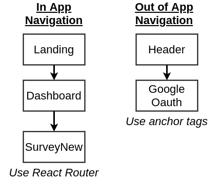

# Notas

En este bloc de notas voy a ir escribiendo todo lo que considero indispensable o importante para el desarrollo de una App con este stack de tecnologias.
El stack involucra: React, Node, Express y PassportJS.
React como libreria principal para el desarrollo front end de la App.
Node como runtime de la app.
Express como Route Handler. Este recibe las HTTP reqs a traves de Node, y decide en base al contenido de la misma, que ruta de funciones le vamos a devolver como response.
Ademas se usa Materialize CSS para los estilos, y Stripe para procesamiento de pagos externo.

## Inicializacion del proyecto:

1. Creamos la carpeta raiz contenedora del server. (mkdir server)
2. Entramos en esta carpeta y hacemos un 'npm init' y le damos todo que si.
3. npm install --save express
4. Creamos el archivo index.js. Dentro de index.js vamos a tener 2 lineas de codigo iniciales que sirven para llamar al modulo express, para que node haga uso del mismo. Estas lineas son las siguientes.

```javascript
const express = require("express");
const app = express();
```

En la primer linea importamos el modulo (ver que usamos CommonJS y no usamos el metodo import), y en la segunda linea instanciamos una app express. En general vamos a estar usando una sola instancia de express.

## Deployment en Heroku

Para testear la app localmente, podemos levantar el localserver directamente instanciando app = express(), utilizando el metodo get de app y escuchando en el puerto 5000.

```javascript
var app = express();

app.get("/", function(req, res) {
  res.send("Hello World!");
});

app.listen(5000, function() {
  console.log("Example app listening on port 5000!");
});
var express = require("express");
```

En la consola tecleamos `node index.js` y automaticamente tenemos un servidor local escuchando a todas las peticiones que se hagan a traves del puerto designado.

### Deployment Checklist

- Dynamic Port Binding: Tenemos que configurar nuestra app para que escuche el puerto que nos asigne Heroku. Para esto, en nuestro index.js, antes de la linea app.listen(), escribimos:

```javascript
const PORT = process.env.PORT;
```

- Specify Node Enviroment: Vamos a decir a Heroku que use una version especifica de Node. Esto lo hacemos en package.json
- Specify start script: tenemos que decir a Heroku que comando correr para arrancar nuestro server. Esto tambien se lo comunicamos a Heroku en el package.json, y obviamente le vamos a decir que use nuestro index.js con el comando node para arrancar el fucking server. "start": "node index.js"
- Create .gitignore file: tenemos que crear el gitignore para que no commitiemos ninguna dependencia que hayamos instalado. Asique dentro del .gitignore vamos a agregar node_modules

### FIRST Deploy:

- Hacernos cuenta en Heroku
- Inicializar repo local en la carpeta del proyecto con git init
- instalar CLI de Heroku
- Dentro de la carpeta de desarrollo, ejecutamos el comando `heroku login`
- Despues de logearnos, le tiramos un `heroku create` para crear la app heroku
- Vamos a ver que nos tira 2 links. El primero es el que vamos a usar si queremos usar nuestra app desde el browser. El segundo es nuestro 'Deployment Target'. Es el repositorio a donde vamos a pushear nuestro local repo.
- Entonces hacemos un `git remote add heroku <ruta-de-repo-heroku-que-nos-tiro-el-comando-anterior>`

### SUBSEQUENT Deploys:

- Guardamos los cambios
- `git add . && git commit`
- Deployamos la app con Git--> `git push heroku master`
- Y una vez que pushea completo, podemos actualizar la pagina y nuestra app se vera con los nuevos cambios


## Googe Auth flow


## Nodemon:

Nodemon es un paquete de npm que nos facilita el trabajo de reiniciar el servidor local de node cada vez que hacemos un cambio en la aplicacion.
`npm install nodemon`.
_package.json "script" object_:
Una vez que instalamos nodemo, podemos agregar un shortcut para ejecutarlo como un script de npm, agregando el atributo "dev": "nodemon index.js" al objeto "script" del package.json. Despues ya podemos ejecutar en la consola `npm run dev`, y el servidor se va a reiniciar solo cada vez que introduzcamos un cambio en la app.

## Google OAuth:

- Ver OAuth flow-chart para entender el flujo de control que se lleva a cabo entre el cliente, el servidor, y google.
- PassportJS library--> Passport y Passport Strategy
- Dependiendo con que servicio (Google, Facebook, github, etc) vamos a hacer la autenticacion, para manejarla tenemos que usar el Passport Strategy correspondiente a ese metodo. Entonces de esta manera primero instalamos la libreria base que es Passport, y despues instalamos el passport strategy correspondiente al servicio que usemos.
- Instalamos Passport y el Passport Strategy de google-oauth dentro de nuestra carpeta de desarrollo, `npm install --save passport passport-google-oauth20`
- Nos loggeamos en console.developers.google.com' y creamos nuestro proyecto. Despues buscamos la api de google+ y configuramos las credenciales para obtener un ID de cliente.
- clientID: Public token, la podemos compartir, lo unico que hace es identificar nuestra aplicacion a los servidores de google.
- clientSecret: no la tenemos que compartir con nadie. Sino ellos tendrian privilegios en nuestra cuenta.
- Entonces tenemos que encontrar una manera segura de acceder a la clientSecret en nuestro codigo, sin vulnerar nuestra seguridad en el caso de que queramos por ejemplo subir el codgio a github. Es decir, tenemos que evitar hardcodearla. Para eso creamos la carpeta config y el archivo keys.js. En donde vamos a almacenar el googleClientID y el googleClientSecret.
-

## Organizacion y estructura de archivos del proyecto:

Para organizar un poco el codigo, agregamos los directorios routes (las rutas que usa express), y services. Ya teniamos el directorio config para las credenciales de la API de google.
En la carpeta de services, creamos un archivo que contiene la logica que ejecuta PassportJS para acceder a las credenciales, Y en la carpeta routes, creamos un archivo que contiene la logica de express para pedir la autorizacion a google para acceder a los datos requeridos del cliente, y la ruta para el callback que se ejecuta una vez concedida la autorizacion.

## MongoDB

MongoDB lo vamos a estar hosteando remotamente con un servicio que se llama MongoDB Atlas, y maneja la configuracion de la database en algun servicio de cloud que seleccionemos. En nuestro caso AWS, pero hay otras opciones como Azure etc. Esta decision es debido a que es mucho mas facil delegar toda esta configuracion de la DB a Atlas que hacerlo por nuestra cuenta de manera Local.
Con MongoDB podemos tener colecciones de objetos que tienen propiedades totalmente diferente, e incluso distinta cantidad de propiedades. Es una de las principales diferencias con una base de datos relacional clasica como MySQL.

### Mongoose

Mongoose es un una libreria de Modelado de Objetos de Datos (ODM en ingles) para MongoDB y Node.js. Maneja las relaciones entre datos, provee de una validacion de esquema, y es utilizado para traducir los objetos en codigo a objetos de MongoDB.

_Model Class_: La model class es una manera de instanciar una coleccion de objetos en MongoDB a traves de mongoose.

En nuestra aplicacion, necesitamos crear una coleccion de usuarios para crear una instancia de cada usuario que se Registro en la app la primera vez, de modo que si en algun momento vuelve a loggearse, podamos consulta en la DB si ese usuario ya esta registrado.
En mongoose tenemos que usar una propiedad llamada Schema, que de alguna manera nos exije que le aclaremos que esquema de propiedades van a tener los objetos que vamos a almacenar en la base de datos. Esto nos saca la libertad que nombramos anteriormente en las caracteristicas principales de MongoDB.
La model class, o en terminos de MongoDB, la nueva Collection, la instanciamos con:

```javascript
mongoose.model("user", userSchema);
```

El metodo de creacion de model class solo lo ejecuta si no exista esa model class previamente creada.

### Agregando un nuevo registro a la DB:

Recordemos que dentro de **./services/passport.js** tenemos la instancia de GoogleStrategy, la cual tiene como segundo argumento, un callback que nos devuelve 4 objetos: entre ellos, tenemos el objeto _profile_. De ahi es que vamos a extraer el atributo 'id' para guardarlo en la DB como prueba de que el cliente se registro.
La Model Class de la coleccion _users_ la tenemos definida en **User.js**.
Ahi vemos como usamos la clase Schema del objeto mongoose para crear un nuevo esquema. Hay un temita con esto, y es que por una cuestion de como trabaja mongoose, no podemos simplemente exportar esta clase e importarla en donde queramos. Podmos considerar que una vez que se creó ese new Schema, despues solo necesitamos hacer un require de mongoose en el archivo que la queramos usar, e instanciar una nueva clase en doonde a mongoose.model le pasamos solo como parametro la coleccion que vamos a modificar en esa instancia. Ejemplo:

```javascript
const mongoose = require("mongoose");

const User = mongoose.model("users"); //Aca User hereda el Schema que ya le dimos previamente
```

**Guardando un registro**:

```javascript
new User({ googleId: profile.id }).save(); //Donde googleId es la propiedad que queremos guardar para este nuevo registro de la coleccion users
```

**Otro detalle a tener en cuenta**, es que el orden de los `require()` importa. De hecho, en el _index.js_, tenemos que importar primero _models/User_ y despues _services/passport_, porque sino el codigo que hay en passport va a querer empezar a usar la coleccion `mongoose.model('users')` sin que todavia se haya instanciado en _User.js_.

### Mongoose Queries:

Podemos usar `User.findOne({ object })` por ejemplo para hacer una consulta a la base de datos buscando si dicho objeto existe.
A tener en cuenta, **Las Queries son ASINCRONAS**. Por lo tanto el metodo findOne, nos devuelve una promesa. Osea que cualquier cosa que queramos hacer en consecuencia a la respuesta de esa Query, lo tenemos que escribir dentro de un `.then()`.

### Generacion de Cookies:

Cuando tengamos un nuevo login de un cliente, el callback de passport se va a fijar si el cliente ya esta registrado en la base de datos chequeando si su googleId existe en la coleccion users. En caso de que exista, ya nos olvidamos de googleId. Ahora vamos a usar el id que genero MongoDB cuando se instancio ese usuario por primera vez, y lo vamos a pasar dentro de una cookie, para que el browser de ese usuario pueda volver a tener acceso a la base de datos sin tener que volver a autenticarse mediante su googleId. Esta operacion la vamos a llevar a cabo mediante Passport, ustilizando serializeUser y deserializeUser:

```javascript
passport.serializeUser((user, done) => {
  done(null, user.id);
});
```

Ese id es el \_id: "iu1y3r87y4aksd" que genero MongoDB, y es la pieza de informacion que le vamos a pasar a la cookie, y la cual vamos a tomar posteriormente con deserializeUser.

```javascript
passport.deserializeUser((id, done) => {
  User.findById(id).then(user => {
    done(null, user);
  });
});
```

Passport es un conjunto de helpers que hacen mas facil la tarea de autenticacion y seguimiento de usuario, el uso de cookies para este ultimo fin, es uno de sus metodos. Para esto, hay que asegurarse de que passport sepa que vamos a usar cookies para trackear los usuarios.

### Cookie Session

Instalamos el paquete con `npm install cookie-session` y lo importamos en nuestro _index.js_.
Ademas tenemos que importar passport en nuestro index.js para poder usar las cookies.

```javascript
app.use(
  cookieSession({
    maxAge: 30 * 24 * 60 * 60 * 1000, //30 dias expresados en ms.
    keys: [keys.cookieKey]
  })
);
```

En este bloque, utilizamos la libreria cookie-session para definir una session abierta por 30 dias. La cookieKey la creamos nosotros y la agregamos al archivo config/keys.js

Despues de esto tenemos que decirle a passport que haga uso de las cookies para manejar la autenticacion.

```javascript
app.use(passport.initialize());
app.use(passport.session());
```

Entonces, una vez que obtenemos la autorizacion de google, registramos el usuario, o en su defecto chequeamos que este registrado, el flujo de seguimiento de sesion de usuario es el siguiente:


Ahora podemos crear un endpoint de nuestra api para probar que podemos acceder al usuario a traves de la cookie. Agregamos entonces a nuestro route handler lo siguiente,

```javascript
app.get("/api/current_user", (req, res) => {
  res.send(req.user);
});
```

PassportJS automaticamente carga la propiedad user en el objeto req (**req.user**). Es por eso que podemos acceder a el cuando el usuario hace una peticion.
Ademas, Passport acopla funciones al objeto req, que podemos usar para manipular el user authentication status. Uno que nos importa es req.logout(). Y podemos agregar otro endpoint a nuestra api utilizando el metodo logout().

```javascript
app.get("/api/logout", (req, res) => {
  req.logout();
  res.send(req.user);
});
```

## Express Middlewares

Los middleware son pequeñas funciones que pueden ser utilizadas para modificar requests entrantes en nuestra app, antes de ser enviadas a los Route Handlers.
La **principal** utilidad en nuestro codigo, es la de procesar tareas comunes a todos los route handlers, para no ser repetitivos y redundantes. De esta manera, lo que hacemos es una especie de preprocesamiento de la request.
Sin embargo, tambien podemos elegir como conectar estos middlewares, y de esa manera determinar su uso para un subconjunto de routehandlers en vez de usarlo en todos los casos.


En nuestro codigo, el primero _middleware_ con el que nos encontramos es un **cookieSession**:

```javascript
app.use(
  cookieSession({
    maxAge: 30 * 24 * 60 * 60 * 1000, //30 dias expresados en ms.
    keys: [keys.cookieKey]
  })
);
```

Lo que hace cookieSession es sacar la data que trae la cookie y asignarla a la propiedad _req.session_.

### cookie-session vs. express-session

Si leemos la documentacion de Express, vamos a ver que nos recomienda usar express-session para el manejo de la sesion de usuario. La principal diferencia entre el paquete cookie-session y express-session, es que cookie-session sirve para guardar pequeña cantidad de informacion del lado del cliente, creo que algo asicomo 4kB, mientras que mediante express-session, la informacion se guardar en el serverside, pudiendo elegir entre muchas opciones de cloud services, y podemos almacenar mucha mayor cantidad de informacion. En nuestro caso no era necesario, ya que solo necesitabamos guardar un ID en la cookie, y eso con cookie-session alcanza y sobra, y nos ahorra el trabajo de tener que configurar la parte de almacenamiento externo que tendriamos con express-session.

## Production Credentials Set

### Keys.js

En este punto lo ideal es separar Keys en 2 archivos. Uno para Dev y otro para Production.
El keys.js (dev) lo tendriamos en nuestro almacenamiento local para hacer todos los tests. El keys.js (prod) lo tendriamos almacenado remotamente, y seria el que tenga las credenciales para todo lo que va en produccion. Una razon para hacer esto, es que si de alguna manera las credenciales que tenemos localmente llegan a manos de otros, nuestra aplicacion y los datos corren peligro, solo eliminamos todo lo que tenga que ver con la app de testing y listo.
La otra razon, es que nos permite tener 2 bases de datos distintas en MongoDB. Una para produccion, que es la que no vamos a tocar nunca una vez deployada, y una para testing, que es a la que podemos manipular y modificar a gusto con el fin de testear cada feature.

Para **Google+ API** tenemos que volver a ir a la consola de desarrollador de google, y creamos un nuevo proyecto _"emaily-prod"_. Y hacemos la misma configuracion que para la version dev. Vamos a credentials y creamos las OAuth ID, pero esta vez, en la ruta de authorized URI ponemos la direccion de nuestra App en heroku (`heroku open` para verla), y le agregamos los endpoints /auth/google/callback. En la ruta javascript de origen ponemos la direccion de la app en heroku pero pelada, hasta el ".com". Vamos a tener que configurar tambien la apariencia del cartel de autorizacion de google, por lo que aca si conviene dedicarle un tiempito ya que va a ser la version final que va a ver el cliente. Es decir, agregarle un logo, descripcion, email de contacto, etc.

## Credentials logic

Ahora que tenemos los dos posibles casos de uso (produccion o dev), nuestro archivo _keys.js_ no va a poseer mas las keys hardcodeadas, sino que va a poseer la logica para devolver las keys necesarias segun el caso en que nos encontremos. La variable que nos va a permitir trabajar con esta logica, es la variable NODE_ENV.
Entonces nuestro nuevo arbol de archivos config se convierte en:
**./config:**

|--dev.js _(ignore)_
|--prod.js _(commit)_
|--keys.js _(commit)_
**keys.js** va a contener la logica para exportar las keys correspondientes

```javascript
//logica para saber que ceredenciales usar
if (process.env.NODE_ENV === "production") {
  //we are in production return prod keys
  module.exports = require("./prod");
} else {
  //si estamos en dev, entonces devolvemos las dev keys, que estan en./dev
  module.exports = require("./dev");
}
```

**prod.js** va a contener el objeto keys correspondiente a las keys importadas desde el entorno de produccion (Heroku) como variables de entorno.
_Ej:_

```javascript
module.exports = {
  tuViejaID: process.env.TU_VIEJA_ID
};
```

Para esto tenemos que guardarlas en la configuracion de Heroku:

1. Ir al dashboard de Heroku
2. Ir a nuestra App
3. Settings
4. Config Variables --> Reveal Config Vars
5. Copiamos cada uno de los nombres de las variables de entorno de _prod.js_ y lo agregamos a la lista, incorporando el valor de cada Key de produccion que hayamos generado.

**dev.js** va a contener el objeto keys, con las claves asignadas para development hardcodeadas en el mismo archivo. Por eso no las commiteamos.

### NODE_ENV

Cuando deployamos nuestra app a Heroku, se crea esta variable que nos dice si estamos en un entorno de produccion o no.

### Google Error: redirect_uri_mismatch

Este error se debe a que google espera que le pasemos un dominio **https** y esta recibiendo un dominio **http**.

1. El primer factor que causa este error es GoogleStrategy. Si vamos a passport.js, vemos que la propiedad callbackURL que le pasamos a GoogleStrategy esta escrita como un relative path (_'/auth/google/callback'_). Lo que hace GoogleStrategy es autocompletar ese dominio con localhost:5000 o con la direccion de nuestra App en Heroku, segun sea el caso.
2. Lo que hace GoogleStrategy esta bien, pero como en nuestro caso la request viene de un Proxy de Heroku, entonces la request no es mas considerada HTTPS, porque internamente no va a confiar en requests que vengan a de un proxy.

Una solucion a este problema, es agregar la opcion **proxy: true** a nuestra instancia de GoogleStrategy.

```javascript
{
      clientID: keys.googleClientID,
      clientSecret: keys.googleClientSecret,
      callbackURL: "/auth/google/callback",
      proxy: true
    },
```

## Create React App

Ahora vamos a crear el client side de nuestra app. Si tenemos npm > 5.2+, entonces podemos crearla directamente con `npx create-react-app client`.
Sino, instalamos react globalmente con `sudo npm install -g create-react-app`.
Si ya lo teniamos instalado globalmente con npm, y queremos usar npx, entonces lo mejor es desinstalarlo globalmente con `sudo npm uninstall -g create-react-app` y despues si hacer `npx create-react-app client`.
Dentro de la carpeta client, corremos `npm start` o `yarn start` y ya tenemos el servidor local de desarrollo.

Como veremos, este server es distinto al server de Express que levantamos para testear el server side de nuestra App.


### ¿Porque usar 2 servidores distintos?

Usamos 2 servidores, uno para el front end y otro para el backend, simplemente porque juntar todas las funcionalidades en un solo servidor, no solo seria muy engorroso, sino que nos privaria de todas las funcionalidades con las que viene Create React App, que son demasiado utiles y necesarias como para dejarlas de lado.

### Como usar los dos servers, frontend y backend

Abrimos el _pacakge.json_ **del server**, y vamos a la parte de scripts.

```json
"scripts": {
    "start": "node index.js",
    "server": "nodemon index.js", //esta linea antes se llamaba dev
    "client": "npm run start --prefix client", //agregamos esta linea
    "dev": "concurrently \"npm run server\" \"npm run client\"" //agregamos esta linea
  }
```

Aca lo que hicimos es agregar el script de ejecucion del _client server_ con un prefix que le indica que lo tiene que ejecutar en el contexto de la carpeta client. Y agregamos un nuevo script _dev_ que nos inicia los dos servers en simultaneo usando el paquete de npm _concurrently_ para correr 2 comandos a la vez. Las backslashes las usamos como caracteres de escape, ya que la doble comilla sola nos terminaria el script de esa linea. Entonces si ahora corremos el comando `npm run dev` dentro de _server_, se nos levantan los servidores locales, el clientside en el puerto 3000 y el serverside en el 5000.

### Interaccion entre React y Node/Express

Como primera prueba, podemos insertar un link de Ingresar Con Google, en nuestra pagina principal de prueba de React App.

```html
<a href="/auth/google">Sign In With Google</a>
```

Aca nos encontramos con un pequeño problema, que no es tan pequeño. Como le pasamos una ruta relativa, React va a entender que queremos ir a http://localhost:3000/auth/google.

¿Como lo resolvemos? En principio es logico pensar que podemos indicarle la ruta completa de esta manera:

```javascript
<a href="http://localhost:5000/auth/google">Sign In With Google</a>
```

¿Pero que pasa cuando estemos en produccion y la URL no sea localhost?. Es por eso que queremos imperiosamente no tener que especificar ni una mierda y escribir solo la ruta relativa. Para esto, vamos a usar un fix, que involucra crear un Proxy.

### [Proxying API Requests en Dev](https://create-react-app.dev/docs/proxying-api-requests-in-development#configuring-the-proxy-manually)

Para versiones de CRA > 2.0+, vamos a usar el siguiente fix.

1. En el directorio **client/** instalar el siguiente paquete:
   `npm install http-proxy-middleware --save`.
2. En **client/src**, crear un archivo de nombre _setupProxy.js_.

3) Agregar los proxies a ese archivo

```javascript
const proxy = require("http-proxy-middleware");

module.exports = function(app) {
  app.use(proxy(["/api", "/auth/google"], { target: "http://localhost:5000" }));
};
```

4. Reiniciar los servidores desde la consola.
5. Cuando ahora apretemos sobre el link de ingresar con google, nos va a aparecer el error de **'redirect_uri_mismatch'** que ya sabemos como resolver.

Entonces, resumiendo, siempre que estemos en el dev-server de Create React App, la ruta relativa va a ser redireccionada por el proxy hacia http://localhost:5000/'ruta-relativa'. Si no estamos en Dev y estamos en produccion, el create-react-app no va a existir mas, por lo cual el server va a ser uno solo (el de Heroku en nuestro caso). Con React vamos a hacer un build, y al server de produccion solo vamos a mandar ese build, y toda la API. Por lo cual en produccion solo vamos a tener un unico server, y las rutas relativas van a hacer referencia a ese unico server.

### La arquitectura de nuestros 2 servidores en dev-mode quedaria asi:


### La arquitectura en produccion quedaria asi:


### Dev OAuth Flow


### Prod OAuth Flow


## Client Side

Aca vamos a configurar todo lo respectivo a React.
En _client/src_ eliminamos todos los archivos boilerplate que tenemos. Y solo dejamos **serviceWorkers.js**, **setupProxy.js** y **setupTests.js**.

Inicialmente vamos a tener 2 archivos base:

- **index.js**: Data layer control (Redux)
- **App.js**: Render layer control (React Router)


Antes que nada vamos a ir a la carpeta **client** e instalar las librerias necesarias.

1. `cd client` ---> `npm install --save redux react-redux react-router-dom`

2. En _client/src_ creamos el archivo index.js. Este archivo va a renderizar el componente root, que en nuestro caso es App.js.

```javascript
import React from "react";
import ReactDOM from "react-dom";

import App from "./components/App";

ReactDOM.render(<App />, document.querySelector("#root"));
```

_ReactDOM.render(**elemento**, **contenedor[, callback]**)_

_Renderiza un elemento React al DOM en el contenedor suministrado y retorna una referencia al componente (o devuelve null para componentes sin estado)._

3. y ademas vamos a crear una nueva carpeta '_components_' dentro de _client/src_. Dentro de esta carpeta es donde vamos a guardar todos los componentes. Creamos entonces el componente App.js

```javascript
import React from "react";

const App = () => {
  return <div>Hi There!</div>;
};

export default App;
```

**ATENSHION PLIS**:
Para nombrar los archivos dentro del client side, vamos a adoptar una forma standar. Si el archivo que estamos por nombrar, **exporta un React Component** (ya sea un class component o function based component), el nombre del archivo empieza con mayusculas. Ejemplo: _App.js_.
Si el archivo que estamos por nombrar **exporta una funcion, o una serie de funciones** lo nombramos todo en minusculas. Ejemplo: _index.js_

### React, Redux, React-Redux

La manera en que se hace un seguimiento global de todo el estado de nuestra app, es mediante Redux. Mas especificamente, el state se guarda en el store de Redux. Solo puede haber un unico store.
El state es un objeto plano de JavaScript y no se debe manipular directamente, solo se debe modificar mediante el despacho de acciones disparadas por eventos en la app.
Para que cada componente de la App tenga acceso al store, se usa un Provider. El **Provider** es un componente que funciona como pegamento entre Redux y React. Tiene una referencia al Store y provee al componente al cual envuelve de la data contenida en el Store.
Para que cada componente se comunique con el **Provider** se usa **Connect**. Cualquiera sea el componente que _wrapiemos_ con Connect, ese componente va a poder acceder a los cambios en el Store state desde el Provider.
La App se renderiza como child del Provider.
En el _index.js_ creamos el store con `createStore()`.

_createStore(**reducer**, **[preloadedState]**, **[enhancer]**)_

```javascript
const store = createStore(() => [], {}, applyMiddleware());
```

y renderizamos el Provider y la App, asociando el provider al store creado:

```javascript
import React from "react";
import ReactDOM from "react-dom";
import { Provider } from "react-redux";
import { createStore, applyMiddleware } from "redux";

import App from "./components/App";

const store = createStore(() => [], {}, applyMiddleware());

ReactDOM.render(
  <Provider store={store}>
    <App />
  </Provider>,
  document.querySelector("#root")
);
```

el document.querySelector("#root") busca dentro de _/public/index.html_ el elemento que tenga `id = "root"` y reactDOM renderiza todo a partir de ese nodo.


Dentro de _/src_ vamos a crear la carpeta contenedora de los reducers.
En nuestro caso vamos a tener una estructura con dos reducers. Uno que se va a encargar de anotar si el usuario esta loggeado (_authReducer_), y otro reducer que se va a encargar de anotar la lista con todas las encuestas que el usuario haya creado (_survaysReducer_).
Vamos a crear un archivo para cada Reducer, y los vamos a combinar en /reducers/index.js con `combineReducers()`.

### Reducers

Cada reducer es una funcion con 2 parametros, el `previousState` y una `action`, y devuelve el siguiente state.

### React Router

React Router va a manejar los componentes que se rendericen segun la URL en la que estemos. Para esto utiliza los componentes `BrowserRouter` y `Route`, ambos pertenecientes al modulo _react-router-dom_.
React Router lo vamos a utilizar dentro de App.js ya que es donde manejamos toda la capa de renderizado de componentes.
_Para navegar a traves de URL's totalmente distintas, vamos a seguir usando el clasico `href="/blabla/bla"`, por ejemplo como es el caso de los botones Login y Logout, donde tenemos que salirnos del index.html para ir a una direccion completamente distinta como lo es el /auth o la /api._

```javascript
import { BrowserRouter, Route } from "react-router-dom";
const App = () => {
  render() {
    return (
      <div className='container'>
        <BrowserRouter>
          <div>
            <Header />
            <Route exact path='/' component={Landing} />
            <Route exact path='/surveys' component={Dashboard} />
            <Route path='/surveys/new' component={SurveyNew} />
          </div>
        </BrowserRouter>
      </div>
    );
  }
};
```

### React Router _\<Link>_

Cuando se trate de un link a una ruta en el mismo documento, vamos a usar el tag <Link> de React Router. Tal es el caso por ejemplo, del Logo de Emaily, en donde al presionarlo queremos que nos redirija a la ruta /surveys, que esta en el mismo documento.



### React CSS Styling - Materialize CSS

Para el estilo de nuestros componentes, vamos a usar una libreria que se llama **Materialize CSS**. Tenemos dos formas de importarla a nuestro proyecto. Una es mediante CDN agregando la ruta en un link tag en nuestro _index.html_. Pero la que vamos a usar nosotros es mediante NPM.
Estando dentro de _/client. _
`npm install materialize-css@next`

### Configuracion y Utilizacion

La libreria materialize-css la vamos a importar en uno de nuestros archivos js, y Webpack se va a encargar de empaquetar ese archivo para que quede disponible como asset en nuestro bundle final.

**Webpack**: Webpack es un Module Loader. Se usa cuando creamos nuestra app con `create-react-app` para configurar y cargar otros modulos.
Webpack ademas corre cada vez que hacemos un cambio en nuestra aplicacion, y lo que hace es empaquetar todos los distintos archivos y modulos, en un conjunto de assets que entiende el navegador.

Para utilizar la libreria materialize-css tenemos que importar los archivos .css que se instalaron al instalar la libreria mediante npm. Estos se encuentran en _client/node_modules/materialize-css/dist/css_. Los podemos importar tanto en index.js como en App.js.

Una vez importados, podemos ver como al darle guardar, ya cambia el estilo default de los componentes.

## Axios y Redux-Thunk

Axios nos va a servir para hacer peticiones Ajax a la Express API desde React. Hace lo mismo que fetch, pero tiene una rango de compatibilidad con buscadores mas amplio que fetch. La sintaxis es apenas distinta.
Redux-Thunk es un middleware que permite la interaccion con el Store de manera asincrona, ya que redux funciona de manera sincrona. Funciona como wrapper de un objeto de accion de redux. Entonces puede ser usado para retrasar el envio de una accion hasta que se cumpla una linea de codigo asincrona. Actua interviniendo con la Dispatch Function (que es la encargada de despachar una accion a los reducers para almacenar el nuevo state en el store), que por defecto en Redux no se toca.
Para mas info https://platzi.com/blog/como-funciona-redux-thunk/

Instalamos ambos en /client: `npm install --save axios redux-thunk`

En _/client/src/index.js_ importamos redux thunk y lo pasamos como parametro al argumento _applyMiddleware()_ en el objeto **store**

## Action Creator

Ahora vamos a crear un action creator, que va a ser la funcion encargada de procesar los cambios de estados derivados de un evento en la app, y mandarlo como Action Object a los reducers para que envien el nuevo app state al store.

1. Creamos una nueva carpeta **actions**: _/client/src/actions_
2. Dentro de **actions**, creamos 2 nuevos archivos, _actions.js_ y _types.js_.

### actions.js

```javascript
import axios from "axios";
import { FETCH_USER } from "./types";

//action creator
export const fetchUser = () => {
  return function(dispatch) {
    axios
      .get("/api/current_user")
      .then(res => dispatch({ type: FETCH_USER, payload: res.data }));
  };
};
```

### types.js

```javascript
export const FETCH_USER = "fetch_user";
```

## Hooking up Components to Redux

1. Importar el **connect** helper de 'redux-react' dentro del Componente.js.
2. Definir la funcion `mapStateToProps()`.
3. Conectar el componente al store modificando la linea export agregandole `connect(mapStateToPropos)(<nombre-del-componente>)`.

# Payment Process

## _Rules of Billing:_

1. Nunca aceptar numeros de tarjetas de creditos enviados directamente a nuestro server.

2. Nunca vamos a guardar numeros de tarjeta de creditos.
3. Siempre vamos a usar un procesador de pagos externo.

## Stripe

Vamos a estar usando Stripe para el manejo de pagos mediante tarjetas de credito ya que se encargan de toda la parte de seguridad y manejo de datos sensibles.
Para esto, lo que vamos a hacer en vez de crear un formulario de pago, es usar una libreria de react que nos provee de un componente CheckOut, en donde los datos ingresados son enviados directamente para que los procese Stripe.
Esa libreria se llama _react-stripe-checkout_.
En client, la instalamos `npm install react-stripe-checkout`.

Ahora para acceder a la API de Stripe nos vamos a loggear y vamos a ir a la seccion del dashboard llamada Developers. Ahi vamos a tener datos como la API-version y ademas las API keys.


#### API keys

Tenemos que agregar las dos keys a nuestro archivo de configuracion de keys que ya teniamos en **/server/config**.
Para eso las agregamos en dev.js:

```javascript
stripePublishableKey: "<aca-pegamos-la-publishable-api-key>",
  stripeSecretKey: "<aca-pegamos-la-secret-api-key>"
```

Agregamos las keys a prod.js:

```javascript
stripePublishableKey: process.env.STRIPE_PUBLISHABLE_KEY,
stripeSecretKey: process.env.STRIPE_SECRET_KEY
```

**RECORDAR de agregar las API-keys a las variables de entorno de Heroku para que esten disponibles en Produccion!!**

### API Keys in server vs API Keys in client

Aca nos encontramos con una dificultad (que mas tarde veremos como lo resolvemos con create-react-app). Dicha dificultad se basa en que en el server-side estamos usando CommonJS mientras que en client-side estamos usando ES6 para importar y exportar, y como no podemos usar `import` dentro de un _if statement_ como si lo podiamos hacer con `require`, entonces para acceder a **./config** utilizando nuestro flujo de control (_dev_ o _prod_) tenemos que usar otro metodo.

Si vamos a la documentacion de `create-react-app` podemos ver que nos permite acceder a variables de entorno definidas por nosotros mismos siempre que comiencen con `REACT_APP_`.
Ademas nos deja crear dos archivos distintos de variables de entorno, uno para _dev_ (**.env.development**) y otro para _prod_ (**.env.production**).
Entonces en **/client** creamos dos archivos:

1. `/client/.env.development` >> REACT_APP_STRIPE_KEY = aslkjdhasldhalskdjad
2. `/client/.env.production` >> REACT_APP_STRIPE_KEY = asdjaslkdhaslkdjhdsal

Ahora desde /client/src/index.js ya podemos acceder a esas variables utilizando `process.env.REACT_APP_STRIPE_KEY`.

//_Se debe reiniciar el dev server una vez creadas las variables de entorno para poder acceder a ellas_//

## Payments Component

Ahora tenemos que hacer que una vez loggeados, se muestre en el Header el boton que va a levantar el formulario de pago de stripe para ser enviado y procesado.
Este boton es el componente que ya viene creado en la libreria `react-stripe-checkout` que instalamos previamente con npm.

Lo que vamos a hacer es crear un class component llamado Payments.js que va a contener el renderizado del boton de stripe-checkout, para posteriormente importar **Payments.js** dentro de **Header.js**.

### Stripe callback Token

El token va a ser un callback que nos va a devolver _Stripe_ cuando enviemos un formulario de pago si esta todo correcto y el pago es procesado.
Cada vez que un usuario compra creditos, esto se tiene que ver reflejado no solo en la interfaz de usuario del cliente sino tambien en el Model object de ese usuario. Para esto vamos a tener que agregar un atributo **credits** a nuestro User Model.
En **User.js**:

```javascript
const userSchema = new Schema({
  googleId: String,
  credits: { type: Number, default: 0 }
});
```

_ver que `credits: { type: Number, default: 0 }` es un atributo cuyo valor es un objeto de atributos **type** y **default**. Estos atributos los podemos ver en mejor detalle en la documentacion de Mongoose_.

Con el token, nosotros vamos a asegurarnos de que el pago se acredito y podremos actualizar el estado de **credits** de dicho usuario.  
**Token Action Creator:** Como los creditos van a formar parte del estado de la app, tenemos que generar un nuevo action creator.

```javascript
export const handleToken = token => async dispatch => {
  const res = await axios.post("/api/stripe", token);

  dispatch({ type: FETCH_USER, payload: res.data });
};
```

Lo que hace este action creator es mandar una post request a _/api/stripe_ pasandole el token como data.
(Aca no entiendo porque usa el mismo type: FETCH_USER que para el action creator de loggin)

Entonces para que nuestra _action_ sea despachada cuando obtengamos el token, lo que vamos a hacer es llamar al _action creator_ que acabamos de crear, dentro del atributo token del componente _StripeCheckout_

```javascript
class Payments extends Component {
  render() {
    return (
      <StripeCheckout
        name="Emaily"
        description="$5 for 5 email credits"
        amount={500}
        token={token => this.props.handleToken(token)}
        stripeKey={process.env.REACT_APP_STRIPE_KEY}
      >
        <button className="btn light-blue">Add credits</button>
      </StripeCheckout>
    );
  }
}
```

### Stripe server-side

Despues de recibir el token de stripe, tenemos la llamada a la action creator que requiere un post a una nueva ruta de nuestra API: _/api/stripe_.
Para esto tenemos que crear el Route Handler que se encargue de recibir esa request, y ejecutar una accion en base a su contenido.
Creamos un nuevo route handler: _/server/routes/billingRoutes.js_ y usamos el mismo boilerplate que usamos con authRoutes:

```javascript
modules.export = app => {
  app.post("/api/stripe", (req, res) => {});
};
```

Ademas tenemos que importar el route handler en nuestro /server/index.js para que pueda ser procesado por Express.js. Debajo del `require("./routes/authRoutes")(app);` escribimos:

```javascript
require("./routes/billingRoutes")(app);
```

Recordemos que al usar ese formato en JS lo que estamos haciendo es llamando a la funcion que nos devuelve la ruta en el primer parentesis del `require()` y en el segundo parentesis pasandole como parametro a dicha funcion la variable `app`, que en nuestro index.js equivale a la instancia creada de `express()`.

### Stripe API wrapper npm:

Tenemos que instalar la API de Stripe para que nuestro backend se comunique con Stripe.

`npm install --save stripe`

### Express body-parser

Por defecto Express tiene un problema y es que al recibir una request, no parsea el contenido del body de dicha request. En nuestro caso es un problema porque en el body de la request tenemos el token. Para esto tenemos que instalar un paquete de npm llamado body-parser. Este es un MiddleWare que parsea el body antes de que los handlers tomen la request. Se accede al contenido del body mediante `req.body`.

`npm install --save body-parser`

### Stripe API Create Charge:

Para registrar en el backend el evento de que un pago ha sido efectuado, la API de stripe nos ofrece el metodo _Create Charge_. Este es el metodo que vamos a consumir cuando accedamos a nuestro handler _/api/stripe_.
En la documentacion de la API, tenemos una seccion dedicada a como crear el _Charge Object_:

```javascript
var stripe = require("stripe")("sk_test_pOnL8Dp1GmNWc9utWckKskYA00TKQfRTDC");

stripe.charges.create(
  {
    amount: 2000,
    currency: "usd",
    source: "tok_visa",
    description: "My First Test Charge (created for API docs)"
  },
  function(err, charge) {
    // asynchronously called
  }
);
```

En nuestro caso, la secret key la importamos desde config.keys.stripeSecretKey. El source va a ser el token que genero stripe en la transaccion y al que accedemos usando el body-parser con req.body.id.
Como cada metodo de la API de Stripe devuelve una Promesa de JS, vamos a usar Async/Await. Entonces nuestro caso quedaria asi:

```javascript
const keys = require("../config/keys");
const stripe = require("stripe")(keys.stripeSecretKey);

module.exports = app => {
  app.post("/api/stripe", async (req, res) => {
    const charge = await stripe.charges.create({
      amount: 500,
      currency: "usd",
      description: "$5 for 5 credits",
      source: req.body.id
    });
    console.log(charge);
  });
};
```

Si ahora vamos a la consola, vamos a ver que nos loggeo todo el objecto Charge:

```json
{
  "id": "ch_1GIEbBFxR4grfntTXfJASqHA",
  "object": "charge",
  "amount": 2000,
  "amount_refunded": 0,
  "application": null,
  "application_fee": null,
  "application_fee_amount": null,
  "balance_transaction": "txn_1GIEbB2eZvKYlo2CFAoVeUku",
  "billing_details": {
    "address": {
      "city": null,
      "country": null,
      "line1": null,
      "line2": null,
      "postal_code": null,
      "state": null
    },
    "email": null,
    "name": "asdasda@asdas.com",
    "phone": null
  },
  "captured": false,
  "created": 1583156781,
  "currency": "usd",
  "customer": null,
  "description": "My First Test Charge (created for API docs)",
  "disputed": false,
  "failure_code": null,
  "failure_message": null,
  "fraud_details": {},
  "invoice": null,
  "livemode": false,
  "metadata": {},
  "on_behalf_of": null,
  "order": null,
  "outcome": null,
  "paid": true,
  "payment_intent": null,
  "payment_method": "card_1GIEYbFxR4grfntTEpzBXWun",
  "payment_method_details": {
    "card": {
      "brand": "visa",
      "checks": {
        "address_line1_check": null,
        "address_postal_code_check": null,
        "cvc_check": "pass"
      },
      "country": "US",
      "exp_month": 10,
      "exp_year": 2020,
      "fingerprint": "dG8L4Gj49IxFr1hM",
      "funding": "credit",
      "installments": null,
      "last4": "4242",
      "network": "visa",
      "three_d_secure": null,
      "wallet": null
    },
    "type": "card"
  },
  "receipt_email": null,
  "receipt_number": null,
  "receipt_url": "https://pay.stripe.com/receipts/acct_1GDspzFxR4grfntT/ch_1GIEbBFxR4grfntTXfJASqHA/rcpt_GpuQxeEgxtC0IIBXUrD2bMErk9yEnfe",
  "refunded": false,
  "refunds": {
    "object": "list",
    "data": [],
    "has_more": false,
    "url": "/v1/charges/ch_1GIEbBFxR4grfntTXfJASqHA/refunds"
  },
  "review": null,
  "shipping": null,
  "source_transfer": null,
  "statement_descriptor": null,
  "statement_descriptor_suffix": null,
  "status": "succeeded",
  "transfer_data": null,
  "transfer_group": null,
  "source": "tok_visa"
}
```

### Actualizar los creditos del usuario

Esto equivale a hacer una actualizacion de la coleccion users de la base de datos.
Como forma parte del proceso de billing, lo vamos a hacer en la logica contenida en **billingRoutes.js**:

```javascript
module.exports = app => {
  app.post("/api/stripe", async (req, res) => {
    const charge = await stripe.charges.create({
      amount: 500,
      currency: "usd",
      description: "$5 for 5 credits",
      source:
        req.body.id /*esto lo obtenemos gracias al paquete npm body-parser*/
    });

    req.user.credits += 5;
    /*Recordar que passport incluye la propiedad user en el objeto
    request cuando se le pasa el _id dentro de la cookie con passport.serializeUser*/
    const user = await req.user.save();
    res.send(user);
  });
};
```

Aca podemos ver que accedemos a la propiedad _credits_ mediante `req.user.credits` y una vez modificado el valor de dicha propiedad, lo tenemos que guardar en la base de datos con el metodos `save()` de _mongoose_.
Como nosotros ademas queremos actualizar lo que ve el usuario, tenemos que mandar el estado actual en la response. Para eso es que usamos el metodo de Express `res.send(user)`.

Notar tambien que usamos _await_ para guardar el nuevo valor, ya que esto es una comunicacion entre nuestro backend (Heroku server) y la base de datos (MongoDB Atlas), que no esta alojada en el mismo servidor, por lo cual es una tarea asincrona y tenemos que esperar a que se concrete antes de poder usar dicha informacion. Si solo pusieramos `req.user.save()` e inmediatamente enviaramos `res.send(user)`, probablemente estariamos enviando una instancia desactualizada de _user_, por no haberle dado el tiempo suficiente al servidor de comunicarse con MongoDB.

# Express middleware

_Tomado de la doc oficial de Express.js_

### Utilización del middleware

Express es una infraestructura web de direccionamiento y middleware que tiene una funcionalidad mínima propia: una aplicación Express es fundamentalmente una serie de llamadas a funciones de middleware.

Las funciones de middleware son funciones que tienen acceso al objeto de solicitud (req), al objeto de respuesta (res) y a la siguiente función de middleware en el ciclo de solicitud/respuestas de la aplicación. La siguiente función de middleware se denota normalmente con una variable denominada next.

### Las funciones de middleware pueden realizar las siguientes tareas:

- Ejecutar cualquier código.
- Realizar cambios en la solicitud y los objetos de respuesta.
- Finalizar el ciclo de solicitud/respuestas.
- Invocar la siguiente función de middleware en la pila.
- Si la función de middleware actual no finaliza el ciclo de solicitud/- respuestas, debe invocar next() para pasar el control a la siguiente función de middleware. De lo contrario, la solicitud quedará colgada.

### Route Handlers

Podemos proporcionar varios callbacks que se comporten como middleware para manejar una solicitud. La única excepción es que estos callbacks pueden invocar next('route') para omitir el resto de los callbacks. Podemos utilizar este mecanismo para imponer condiciones previas en una ruta y, a continuación, pasar el control a las rutas posteriores si no hay motivo para continuar con la ruta actual.

Un route handler puede tener la forma de una funcion, un array de funciones, o la combinacion de ambas.

**En nuestro caso**, podemos ver un ejemplo de un route handler con varios middlewares en _billingRoutes.js_, donde tenemos 2 callbacks a modo de middlewares. Dentro de un route handler se puede tener la cantidad de middlewares que se quiera, pasandolos como argumento luego de declarar la ruta. La unica condicion es que eventualmente alguno de esos middlewares procese la request y mande una respuesta al destinatario que origino la request.

# Deploying Serverside && Clientside to Heroku

### Problema

Recordemos que en Development teniamos un client server dedicado a "servir" todos los archivos relacionados con el Client side, que nos lo proporcionaba create-react-app.
En produccion, no vamos a tener un server de create-react-app corriendo en paralelo. Vamos a tener un bundle contenido en algun directorio o 'public assets' que el server de produccion va a devolver al cliente cada vez que lo requiera.

Tenemos entonces que hacer que nuestro Node/Express API Server sepa como distinguir si esta en Prod o Dev, para asi decidir si tiene que ir a buscar los Public Assets, o dejar que los maneje create-react-app.

El problema principal que se nos presenta es el manejo de rutas que en Dev las manejaba React Router dentro del client server generado por create-react-app. En Dev, Express nunca se tuvo que hacer cargo de eso, ya que solo se encargaba de manejar los procesos de autenticacion, y API's. Pero el trabajo de decidir que presentar en pantalla ante el usuario lo hacia siempre React con React Router utilizando el servidor corriendo en el puerto 3000.

### Solucion

Lo que hacemos entonces en Produccion, es decirle a Express que cada vez que le llegue una solicitud a una ruta que no comprende (ejemplo: /surveys), entonces que nos devuelva el index.html. Esto va a hacer que cuando se cargue el index.html (generado por nuestro `npm run build`) en nuestro browser, index.html solicite al server ademas los archivos necesarios para cargar la logica de React. Entonces tambien le aclaramos a Express que cuando el cliente solicite `/client/build/static/js/main.js`, le devuelva _main.js_. Y de esta manera, ahora **React Router** tiene todo lo necesario para determinar que dada la ruta /surveys solicitada por el cliente, tiene que presentar el componente **{ Dashoard }** en pantalla.

Entonces, en el `./server/index.js`, debajo de los express Routers previamente configurados escribimos lo siguiente:

```javascript
if (process.env.NODE_ENV === "production") {
  //Express will serve up production assets
  //like our main.js file, or main.css file!
  app.use(express.static("client/public"));
  //Express will serve up the index.html file
  //if it doesn't recognize the route
  const path = require("path");
  app.get("*", (req, res) => {
    req.sendFile(path.resolve(__dirname, "client", "build", "index.html"));
  });
}
```

De esta manera, primero chequeamos si en verdad estamos corriendo la app en produccion (Heroku). Si ese es el caso, entonces ponemos a disponibilidad todos los archivos que estan en la ruta `./client/public` montando el _express.static_ middleware con `app.use(express.static("client/public"));`
Ahora nos encargamos de rutear cualquier request que venga con un path no reconocido **('\*')**, de manera que devuelva el `index.html`.
Esto lo hacemos usando el modulo _path_ de Node.js que nos da herramientas para trabajar con rutas de archivos y directorios, y con el metodo _sendFile_ de _express()_ que nos permite enviar el archivo que le pasamos como parametro al metodo.

## Deployment Options


De estas opciones, la #1 se considera muy poco segura ya que nunca deberiamos comitear un build. La #2, es segura pero deja instaladas muchas dependencias en el server de produccion que solo son necesarias para dev.
La #3 es la que mas se suele encontrar en el work-flow de empresas y start-ups tecnologicas, aunque requiere de la preparacion de un servidor de Integracion Continua.
Por cuestiones de practicidad y complejidad, para este proyecto vamos a ir por la opcion #2, ya que el solo hecho de incorporar un servidor de Integracion Continua es material para otro proyecto.

## [Heroku Build Steps (Docs)](https://devcenter.heroku.com/articles/nodejs-support#build-behavior)

## Survey creation

### Overview


Nuestra aplicacion requiere que podamos guardar las surveys creadas, asi como tambien guardar un registro de los encuestados y sus respuestas. Para esto, vamos a tener que usar nuestra base de datos y crear un nuevo modelo.
Entonces, siguiendo el mismo esquema que usamos para `models/User.js`, vamos a crear un `models/Surveys.js` y lo vamos a importar en nuestro **server/index.js**.
Cada vez que el Product Owner use nuestra aplicacion para crear un survey y enviarla, a nuestro servidor nos tendria que llegar esta informacion basica de ese evento:

Survey:

- title
- body
- subject
- recipients
- yes
- no

Donde _yes_ y _no_ son los campos que llevan el conteo de la encuesta. Ademas, tenemos que considerar el caso en que un encuestado oprima mas de una vez el boton de respuesta de la encuesta. Esto lo podemos arreglar, haciendo que el campo _recipients_ sea un **objeto** que contenga el _email_ del recipient (String), y una variable de estado que podemos llamar _clicked_ (Boolean) que va a indicar si el encuestado ya clickeo o no.
En Mongoose, estos objectos se llaman **Subdocument Collections**

**IMPORTANTE:** MongoDB solo admite 4Mb por Document. Por eso es que tenemos que tener cuidado al anidar Subdocuments ya que podemos agotar la capacidad de almacenamiento del parent Document bastante rapido.

Nuestro primero Subdocument Collections va a ser `Recipient.js`

```javascript
const mongoose = require("mongoose");
const { Schema } = mongoose;
const recipientSchema = new Schema({
  email: String,
  responded: { type: Boolean, default: false }
});

module.exports = recipientSchema;
```

**NOTA IMPORTANTE:**
En el mejor de los casos, cada instancia de usuario en nuestra db tendria que tener su propio Subdocument "Survey". El problema como ya mencionamos, es la memoria. A medida que un user agrega Surveys, cada nueva instancia, va a poder contener menor cantidad de datos, ya que el almacenamiento maximo lo tiene el Document Parent que es nuestra instancia de User, y es 4 Mb.
Entonces vamos a evitar este tipo de estructura anidada, y en vez de ello, relacionar a la User Collection con la Survey Collecion, para que cada _survey_ se relacione con un unico _user_.
Para eso vamos a agregar una nueva propiedad _\_user_ a nuestro Survey Schema, haciendo uso de un tipo de dato de mongoose para establecer una relacion de many to one:

```javascript
_user: { type: Schema.Types.ObjectId, ref: 'User'}
```

## Survey-Creation Route Handler

Ahora tenemos que configurar el endpoint `/api/surveys` para procesar la creacion de una nueva survey.
Para esto tenemos que considerar dos cosas. Primero, que el usuario este Loggeado, ya que cualquier vivito podria tirarle a pegar endpoints en la url y encontrar `api/surveys` sin estar loggeado. Asique aca vamos a hacer uso del middleware `requireLogin` que creamos anteriormente en nuestra carpeta middlewares.
Ademas, tenemos que asegurarnos de que el usuario posee el minimo de creditos para realizar esa operacion. Aunque en nuestra aplicacion este va a ser el unico proceso en el cual requiramos ese chequeo, podemos considerar una buena practica agregarlo como Middleware, ya que podria ser requerido en futuras nuevas features de la App.
Entonces, siguiendo una logica parecida a la que usamos en `requireLogin`, creadmos `middlewares/requireCredits.js`:

```javascript
module.exports = (req, res, next) => {
  if (req.user.credits < 1) {
    return res.status(403).send({ error: "Not enough credits." });
  }
  next();
};
```

### Logica de la API


